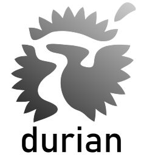

<div align="center">
        
</div>

##

**Durian is a collection of Roslyn-based analyzers, source generators and utility libraries that bring many extensions to C#, with heavy emphasis on features that can be found in other existing langauges. It's main goal is to make C# easier and more pleasant to use through reducing necessary boilerplate code, while at the same time providing additional layers of flexibility.**

## Current state

Right now, Durian is only at the first stage of its evolution. As for its initial release on the 1st of June 2021, two modules - *Core* and *DefaultParam* - are available, with additional two - *StructInherit* and *GenericSpecialization* - in early development. This does not include two already existing packages that are not part of any module - *Durian.AnalysisServices* and *Durian.TestServices*.

For more information about a specific package or module, go to the *README.md* file in the according project's directory in the *\\src\\* folder.

## Features

### DefaultParam

DefaultParam allows the user to specify a default type for a generic parameter.

```csharp
using Durian;

public class Test<T, [DefaultParam(typeof(string))]U>
{
}

// Generated

public class Test<T>
{
}

```

## What's next?

At the moment, two modules are in experimental stage - *StructInherit* and *GenericSpecialization*, with the latter being further in development. Release dates are yet to be determined.

## Structure

Durian distinguishes between two types of entities - modules and packages. A package is the same as a normal NuGet package - it is ment to be published as a standalone library offering specific service. Modules on the other hand are a group of packages that, once joined together, provide full capabilities for the common task they represent. A good example is when there are three packages - one with Roslyn analyzer/source generator, one with code fixes and one with attributes exposed to the user to communicate with the generator in the first package. Since all of them are dependent on each other, it makes sense to include them in a single module.

In normal circumstances, a module would include 1-3 packages. A single package can be a part of multiple modules or neither.

## History

Durian started as a personal project of a high school student from Gdañsk, Poland - Piotr Stenke, amateur C# programmer and Unity Engine enthusiast. Though the sole idea emerged in late 2020, any actual work didn't take place until Februrary 2021. First months of development were especially challenging, with final exams in school, deadly virus roaming all around the globe and adult life slowly, but steadily, approaching. And all of that without even mentioning the worst part - learning from stratch this awful, unintuitive, badly-documented mess of an API that is Roslyn.

At its initial release on the 1st of June 2021, Durian was ment to be a major trade card that would get its author into the IT industry. 

##

*\(Written by Piotr Stenke\)*